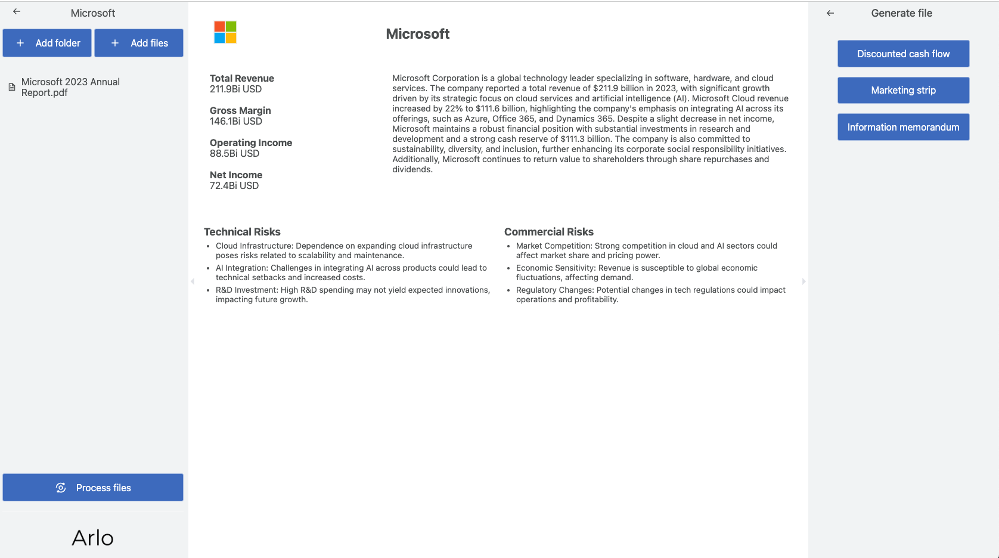

# Arlo

RAG tool for investment bankers. A powerful application that helps analyze and manage deal-related documents using AI.

## Screenshot



## Features

### 1. Deal Management
- Create and organize multiple deals
- Hierarchical file structure for each deal
- Drag-and-drop file organization
- Support for multiple file formats

### 2. Document Analysis
- AI-powered document processing
- Automatic information extraction
- Interactive dashboard with:
  - Key Performance Indicators (KPIs)
  - Deal summaries
  - Risk analysis categorization
  - Company information display

### 3. AI Assistant
- Interactive chat interface with context-aware responses
- Document-based question answering
- Source attribution for answers
- Chat history tracking
- Markdown support for formatted responses

### 4. Q&A Tracker
- Track important questions and answers
- Organize deal-specific queries
- Collaborative question management
- Historical question archive

### 5. Document Generation
- Automated file generation based on analyzed documents
- Customizable templates
- User parameter inputs
- Downloadable output files

## Installation

Copy all variables from `.env.example` to new created `.env` file and change the appropriate variables with your values. You can get all necessary data at [Platform OpenAI](https://platform.openai.com/api-keys).

Install dependencies.

```bash
  npm i
```

Start backend server with nodemon.

```bash
  npm run dev:back
```

Start frontend server with vite.

```bash
  npm run dev:front
```